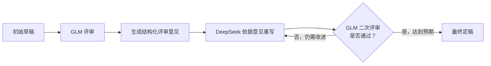

# Vibe Writing：多模型协作写作工作流

## 1. 概念定义

**Vibe Writing**（多模型协作写作）是一种利用多个大型语言模型（LLM）进行迭代式文档创作与优化的方法论。其核心理念在于：不同模型在文本处理上存在能力差异与"风格偏好"（Vibe），通过建立结构化的协作流程，让各模型专注于其相对优势环节，可以突破单一模型的思维定式与能力局限，从而系统性提升文档的整体质量。

## 2. 模型能力分析与角色分工

在实践中，不同模型展现出的特长各异。本工作流基于对模型能力的客观分析，进行如下角色分配：

| 模型 | 角色 | 相对强项 | 相对弱项 |
| :--- | :--- | :--- | :--- |
| **GLM（智谱系列）** | 评审专家 | 批判性思维、逻辑推理、结构分析、风险识别、内容完备性审查 | 创意性语言生成、文学性修饰、自由风格转换 |
| **DeepSeek系列** | 写作者/重构者 | 语言流畅度、表达优化、风格调整、结构化内容的流畅重组、指令跟随 | 严格的自我批判、识别自身生成内容的逻辑盲点 |

**技术解释**：GLM 类模型通常在训练中强化了逻辑与结构任务，使其在分析性任务上表现稳定；DeepSeek 类模型则在文本生成流畅度和多样化表达方面有突出表现。这种能力差异构成了协作的技术基础。

## 3. 核心工作流程

工作流是一个"评审-重写"的循环迭代过程，旨在通过外部视角持续修正与提升文档。



**循环说明**：每一次完整的"评审-重写"构成一轮迭代。通常经过 2-3 轮迭代，文档质量提升的边际收益显著下降，即可进入定稿阶段。

## 4. 环境准备与前置条件

在实践本工作流或运行自动化脚本前，请确保满足以下条件：

1.  **模型 API 访问权限**：已获取 GLM（如 `glm-4-plus`） 和 DeepSeek（如 `deepseek-chat`） 等模型的有效 API Key 及接口调用权限。
2.  **命令行工具链**：本地已安装并配置好通用的 LLM 命令行调用工具（如 `llm`、`curl` 或专属 CLI），并确保其支持目标模型。
3.  **文档格式**：初始文档建议使用纯文本或 Markdown 格式，以确保在模型间传递时内容结构不丢失。
4.  **成本预估**：此工作流涉及多次模型调用，总成本与文档长度、迭代轮数正相关。在批量处理长文档前，建议进行小规模测试以评估成本。

## 5. 实践案例：技术文档优化

以《LLM 命令行工具使用指南》的编写为例，展示完整流程。

### 5.1. 初始草稿
作者快速撰写初稿，内容基本完整但存在结构松散、表述口语化、部分步骤缺失等问题。

**初始草稿片段示例**：
```markdown
# 怎么用LLM命令行工具
装好之后，你得先设置一下API key，不然用不了。命令大概是 `llm set-api-key openai xxx`。然后就可以问问题了，比如 `llm "今天天气怎么样"`。
```

### 5.2. 第一轮评审（GLM）
将初稿提交给 GLM，并指示其从**结构、内容、表达**三个维度进行评审。

**GLM 生成的评审意见（摘要）**：
*   **结构**：缺乏清晰的章节划分（如安装、配置、使用、高级功能），内容呈线性堆砌。
*   **内容**：缺失具体的安装方法；`set-api-key` 命令示例未说明参数来源；未提及模型选择、对话历史管理等常用功能。
*   **表达**：标题过于随意（"怎么用"）；描述性语言不专业（"装好之后"、"问问题"）；代码块未指明语言类型。

### 5.3. 第一轮重写（DeepSeek）
将上述评审意见连同原稿一并提交给 DeepSeek，指令其根据意见重构文档。

**修改前后对比**：

| 维度 | 修改前 | 修改后（DeepSeek 输出） |
| :--- | :--- | :--- |
| **标题** | `# 怎么用LLM命令行工具` | `# LLM 命令行工具使用指南` |
| **结构** | 单一章节 | `## 1. 安装`<br>`## 2. 配置`<br>`## 3. 基本使用`<br>`## 4. 高级功能` |
| **内容** | "命令大概是 `llm set-api-key openai xxx`" | "在终端执行以下命令配置 API Key，其中 `<your_api_key>` 需替换为从提供商处获取的实际密钥：<br>`llm set-api-key openai <your_api_key>`" |
| **表达** | "然后就可以问问题了" | "完成配置后，即可通过简单的命令行指令与模型交互：" |

### 5.4. 后续迭代
将 DeepSeek 生成的重写稿再次交由 GLM 评审。GLM 可能提出更细粒度的优化建议（如添加错误处理示例、补充不同操作系统的差异说明等）。DeepSeek 根据新意见进行第二轮优化。经过 2-3 轮，文档趋于成熟。

## 6. 自动化实现脚本

以下脚本通过命令行工具 `llm` 实现工作流自动化。**请注意**：脚本中的模型名称、路径、API 调用方式均为占位符，需根据实际环境配置。

```bash
#!/bin/bash
# vibe_writing_workflow.sh - 多模型协作写作自动化脚本
# 依赖：已配置好的 `llm` 命令行工具，及对应的 GLM、DeepSeek 模型配置。

# 用户变量配置
INPUT_FILE="$1"
REVIEWER_MODEL="${REVIEWER_MODEL:-glm-4-plus}" # 评审模型，使用环境变量或默认值
WRITER_MODEL="${WRITER_MODEL:-deepseek-chat}" # 写作模型，使用环境变量或默认值
MAX_ROUNDS="${2:-2}" # 最大迭代轮数，默认为2

# 工作目录与文件前缀
WORK_DIR="./vibe_writing_output"
mkdir -p "$WORK_DIR"

echo "启动 Vibe Writing 工作流..."
echo "输入文档: $(basename $INPUT_FILE)"
echo "评审模型: $REVIEWER_MODEL"
echo "写作模型: $WRITER_MODEL"
echo "最大轮次: $MAX_ROUNDS"
echo "输出目录: $WORK_DIR"
echo ""

CURRENT_DRAFT="$INPUT_FILE"

for (( round=1; round<=$MAX_ROUNDS; round++ )); do
    echo "=== 第 ${round} 轮迭代 ==="

    # 步骤一：GLM 评审
    REVIEW_FILE="$WORK_DIR/review_round_${round}.md"
    echo "[1/2] 正在使用 $REVIEWER_MODEL 进行评审..."
    llm -m "$REVIEWER_MODEL" \
        "你是一位严格的技术文档评审专家。请从以下三个维度对提供的文档进行全面评审，并给出具体、可操作的改进建议：
        1. **结构**：逻辑层次、章节划分、顺序合理性。
        2. **内容**：准确性、完整性、时效性、示例安全性。
        3. **表达**：术语准确性、语言流畅度、格式规范性。

        请直接输出评审意见，无需概括性前缀。

        【待评审文档】
        $(cat "$CURRENT_DRAFT")" > "$REVIEW_FILE"
    echo "   评审意见已保存至: $(basename $REVIEW_FILE)"

    # 步骤二：DeepSeek 重写
    NEW_DRAFT="$WORK_DIR/draft_round_${round}.md"
    echo "[2/2] 正在使用 $WRITER_MODEL 根据评审意见重写..."
    llm -m "$WRITER_MODEL" \
        "请根据以下【评审意见】，对【原文档】进行重构和优化。
        要求：
        - 严格遵循评审意见中的所有可行建议。
        - 输出完整、可直接使用的 Markdown 格式文档。
        - 保持原文档核心信息不变。
        - 优化语言，使其专业、清晰、流畅。

        【评审意见】
        $(cat "$REVIEW_FILE")

        【原文档】
        $(cat "$CURRENT_DRAFT")" > "$NEW_DRAFT"
    echo "   重写稿已保存至: $(basename $NEW_DRAFT)"
    echo ""

    # 准备下一轮迭代
    CURRENT_DRAFT="$NEW_DRAFT"
done

echo "工作流执行完毕。"
echo "最终稿件位于: $CURRENT_DRAFT"
echo "所有中间文件保存在: $WORK_DIR"
```

**使用方法**：
1.  配置好 `llm` 命令行工具及对应模型的 API。
2.  将脚本保存为 `vibe_writing_workflow.sh`。
3.  执行命令：`chmod +x vibe_writing_workflow.sh`
4.  运行脚本：`./vibe_writing_workflow.sh 你的初稿.md [迭代轮数]`

## 7. 适用场景与模型角色调整建议

本工作流主要适用于对逻辑性、准确性、结构性要求较高的文档创作。在不同场景下，可参考以下角色配置：

| 场景类型 | 评审模型 | 写作模型 | 说明 |
| :--- | :--- | :--- | :--- |
| 技术文档/API手册 | GLM | DeepSeek | 确保结构严谨、逻辑清晰、描述准确。 |
| 学术论文/实验报告 | GLM | DeepSeek | 强化论证链条、规范表达、确保内容完备。 |
| 商业计划/分析报告 | GLM | DeepSeek | 优化叙事逻辑、数据呈现、提升说服力。 |
| 创意文案/故事创作 | **DeepSeek** | **GLM** | **可互换角色**：用DeepSeek激发创意，用GLM进行逻辑梳理和结构规整。 |

## 8. 局限性与风险

1.  **成本与效率**：多轮模型调用会增加时间和金钱成本，不适合对时效性要求极高或预算极其有限的场景。
2.  **模型能力漂移**：模型供应商可能更新模型版本，其能力特点可能发生变化，需要定期验证角色分工的有效性。
3.  **信息衰减与幻觉**：在多次重写过程中，可能存在核心信息被无意简化或扭曲的风险，同时模型也可能在重写中引入新的"幻觉"内容。
4.  **过度优化**：在追求语言流畅和结构完美的过程中，可能牺牲掉原文某些特有的、有价值的个人化表达或细微洞见。
5.  **工具链依赖**：自动化脚本的稳定运行依赖于外部命令行工具和API服务的可用性，存在工具链中断的风险。
6.  **最终责任**：本工作流是辅助工具，**生成内容的最终责任，尤其在涉及事实、数据、安全指令的部分，必须由人类作者进行最终审核与确认**。

## 9. 最佳实践与提示（Prompt）要点

*   **评审指令**：给予评审模型的指令应具体，明确评审维度（如结构、内容、表达），并要求提供**具体案例和修改建议**，避免"整体不错，略有不足"等模糊反馈。
*   **重写指令**：给予写作模型的指令必须强调"**直接输出完整文档**"，而非仅提供修改建议。同时应要求其"**保留原文档所有核心信息与事实**"。
*   **过程管理**：务必保留每一轮的评审意见和生成稿，便于追溯修改思路，并在质量不升反降时快速回退。
*   **迭代控制**：设置明确的停止条件（如轮数、或当评审意见主要为细微措辞调整时），避免无限循环，追求性价比。
